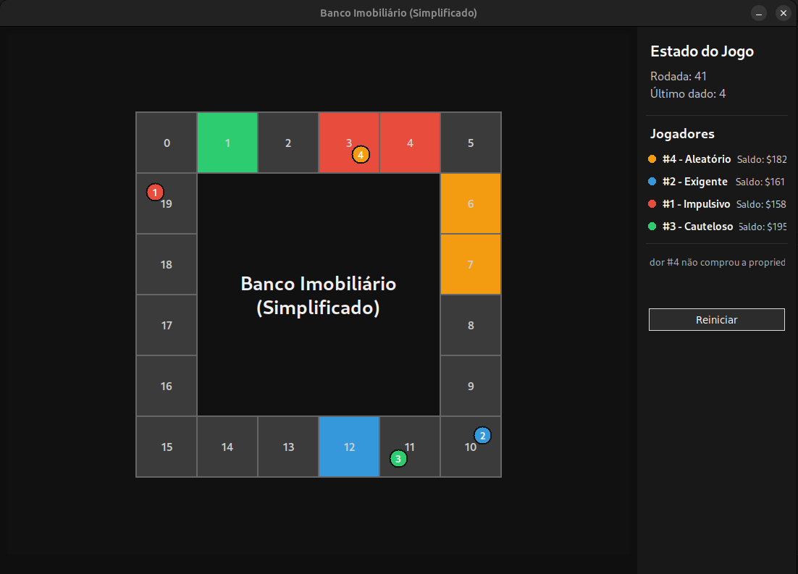

# Simulador de Tabuleiro

## Objetivo

O desenvolvimento deste projeto foi guiado por uma orientada a objetos dos principais componentes de um jogo de tabuleiro.  
A ideia central foi criar não apenas uma **simulação** com parâmetros pré-definidos, mas também estabelecer um **core reutilizável** para um sistema de jogo de tabuleiro completo.

## Estrutura do Core

- **Jogo** – controla as regras e a execução da simulação.  
- **Tabuleiro** – representa o espaço do jogo e suas casas.  
- **Jogador** – entidade principal que participa do jogo.  
- **Estratégias (interface `Estrategia`)**:
  - `Impulsivo`
  - `Exigente`
  - `Cauteloso`
  - `Aleatorio`

Essas estratégias seguem a mesma interface, permitindo simular diferentes estilos de jogo.

## Setup do Projeto

1. Clone o repositório:
   ```bash
   git clone https://github.com/seu-usuario/seu-projeto.git
   cd seu-projeto
   ```

2. Crie e ative um ambiente virtual:
   ```bash
   python -m venv venv
   source venv/bin/activate   # Linux/Mac
   venv\Scripts\activate      # Windows
   ```

3. Instale as dependências:
   ```bash
   pip install -r requirements.txt
   ```

4. Execute a API:
   ```bash
   python app.py
   ```

5. (Opcional) Execute a interface gráfica da simulação:
   ```bash
   python simulation_interface.py
   ```
  
6. (Opcional) Execute a simulação teste:
   ```bash
   python test.py
   ```

---

## API – Como Usar

O endpoint principal aceita dois parâmetros:  

- **qtd_casas** (opcional) → número de casas do tabuleiro (padrão: `20`)  
- **jogadores** (opcional) → número de jogadores (padrão: `4`)  

### Exemplo de Request
```bash
curl "http://localhost:8080/jogo/simular?qtd_casas=30&jogadores=5"
```

### Exemplo de Resposta
```json
{
  "jogadores": [
    "impulsivo",
    "exigente",
    "cauteloso",
    "aleatorio"
  ],
  "rodadas": 152,
  "termino_por_tempo": false,
  "vencedor": "cauteloso"
}
```

---

## Observações

Durante simulações com múltiplos jogadores, foi observada uma **tendência da estratégia "Impulsivo"** em vencer ou ocupar posições de destaque no ranking final.

---

## 🎨 Interface Gráfica

Uma interface visual foi desenvolvida para tornar a simulação mais intuitiva:  

```bash
python simulation_interface.py
```

